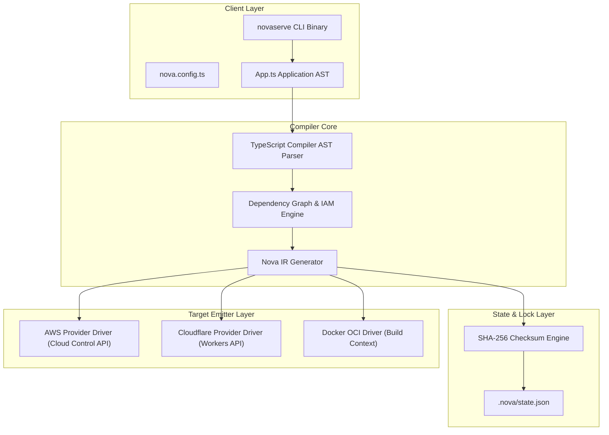

# Deep System Architecture

This document presents the system architecture of NovaServe, its execution primitives, state isolation mechanisms, and hyper-scaler integration model.

---

## Architectural Principles

1. **Application-Defined Infrastructure**: Infrastructure declarations reside inside application code, allowing compiler-driven static optimization.
2. **Deterministic State Compilation**: Given identical source code ASTs, the compiler guarantees identical Nova IR schemas and SHA-256 state lock hashes.
3. **Zero-Trust Privilege Boundary**: Security roles and IAM policies are generated algorithmically by inspecting code AST references without human configuration.
4. **Cloud Hyper-scaler Abstraction**: Nova IR decouples high-level cloud abstractions (`api`, `storage`, `queue`, `database`) from provider specific APIs.

---

## High-Level System Architecture Diagram

