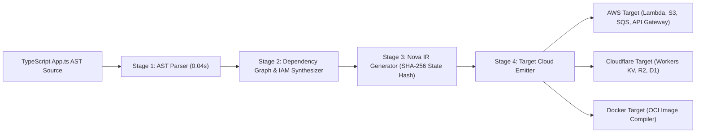

# Compiler Pipeline Architecture

NovaServe treats cloud infrastructure as a compilation target rather than a set of imperatively invoked API scripts.

This document details the 4-stage pipeline that transforms TypeScript application source code into deterministic cloud deployments.

---

## Compiler Pipeline Architecture Diagram

---

## The 4 Pipeline Stages

### Stage 1: AST Parser & Static Analysis

- **Input**: TypeScript application source file (`App.ts`).
- **Mechanism**: The parser scans the Abstract Syntax Tree (AST) using TypeScript compiler APIs. It extracts all static invocations of NovaServe primitives (`defineApp`, `api`, `storage`, `queue`, `database`).
- **Output**: Unlinked Abstract Syntax Tree Nodes representing application handlers and resource declarations.
- **Determinism**: Fully static; code execution is not required to extract resource bindings.

### Stage 2: Dependency Graph Engine & IAM Inference

- **Input**: Parsed AST nodes.
- **Mechanism**:
  1. The engine constructs a Directed Acyclic Graph (DAG) of resource dependencies (e.g. `api.post("/tasks")` -> `uploads` bucket & `taskQueue` queue).
  2. It analyzes handler function bodies for method invocations (e.g., `uploads.put()`).
  3. It automatically synthesizes least-privilege IAM policies, mapping method calls to explicit provider API actions without wildcards (`s3:PutObject`).
- **Output**: Resource DAG + Synthesized IAM Policy JSON specifications.

### Stage 3: Nova Intermediate Representation (Nova IR)

- **Input**: Validated Resource DAG & IAM specs.
- **Mechanism**: The compiler serializes the graph into a normalized, provider-neutral format called **Nova IR**. It calculates a SHA-256 cryptographic checksum of the entire graph state.
- **Output**: Standardized Nova IR JSON payload & SHA-256 state lock file (`.nova/state.json`).

### Stage 4: Target Cloud Emitter & Provisioning Engine

- **Input**: Nova IR payload + Target Provider selection (`aws`, `cloudflare`, `docker`).
- **Mechanism**: The emitter translates provider-neutral IR resource declarations into target manifest drivers (e.g. AWS Cloud Control API, Cloudflare API, or Docker build context).
- **Output**: Deterministically provisioned cloud resources + updated live state lock.

---

## Why a Compiler Approach Matters

1. **Elimination of Duplicate Config**: Infrastructure resources are declared alongside application handlers in type-safe code.
2. **Zero-Trust Security by Default**: Compiler-driven IAM policy synthesis ensures function handlers only receive access to the exact resources they touch in code.
3. **Multi-Cloud Target Portability**: The intermediate representation (Nova IR) decouples your application logic from hyper-scaler vendor APIs.
