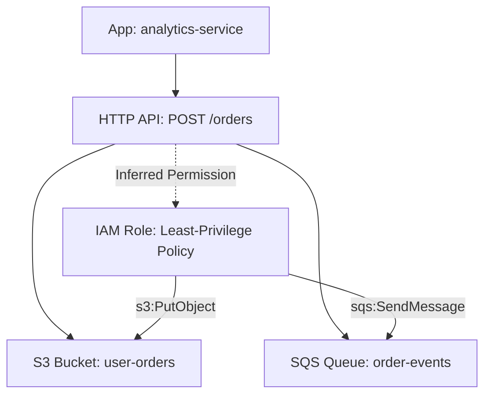

# Dependency Graph Engine & IAM Inference

This document explains how NovaServe builds Directed Acyclic Graphs (DAGs) and derives least-privilege IAM policies automatically from code AST references.

---

## 1. Directed Acyclic Graph (DAG) Construction

Once AST static analysis completes, NovaServe constructs an in-memory Directed Acyclic Graph representing all resource dependencies.

### Nodes and Edges

- **Nodes**: Cloud primitives (`App`, `StorageBucket`, `MessageQueue`, `DatabaseTable`, `HttpEndpoint`, `IamRole`).
- **Edges**: Binding references between resources. For example, if `HttpEndpoint` calls `storage.put()`, a directed edge (`HttpEndpoint -> StorageBucket`) is registered.



---

## 2. Automated IAM Policy Synthesis

Security misconfigurations are a leading cause of cloud security breaches. Traditional developers often use wildcard permissions (`Action: s3:*`, `Resource: *`) because hand-writing granular AWS IAM JSON policies is error-prone.

NovaServe eliminates over-privileged access by deriving IAM permissions directly from AST references:

### Method to Permission Mapping Table

| TypeScript Method Call | Inferred AWS IAM Action | Inferred Cloudflare Scope | Inferred GCP Permission |
| :--- | :--- | :--- | :--- |
| `storage.put(key, body)` | `s3:PutObject` | R2 Write Access | `storage.objects.create` |
| `storage.get(key)` | `s3:GetObject` | R2 Read Access | `storage.objects.get` |
| `storage.delete(key)` | `s3:DeleteObject` | R2 Delete Access | `storage.objects.delete` |
| `queue.push(message)` | `sqs:SendMessage` | Queue Producer Scope | `pubsub.topics.publish` |
| `queue.pop()` | `sqs:ReceiveMessage`, `sqs:DeleteMessage` | Queue Consumer Scope | `pubsub.subscriptions.consume` |

---

## Example Synthesized IAM Policy JSON

For a route handler calling `uploads.put(...)`, NovaServe generates the following AWS IAM policy automatically during `nova compile`:

```json
{
  "Version": "2012-10-17",
  "Statement": [
    {
      "Effect": "Allow",
      "Action": [
        "s3:PutObject"
      ],
      "Resource": "arn:aws:s3:::user-orders/*"
    }
  ]
}
```

Notice that:
- **No Wildcard Actions**: `s3:*` is never emitted.
- **Resource Scoped**: The permission is restricted strictly to `arn:aws:s3:::user-orders/*`.
