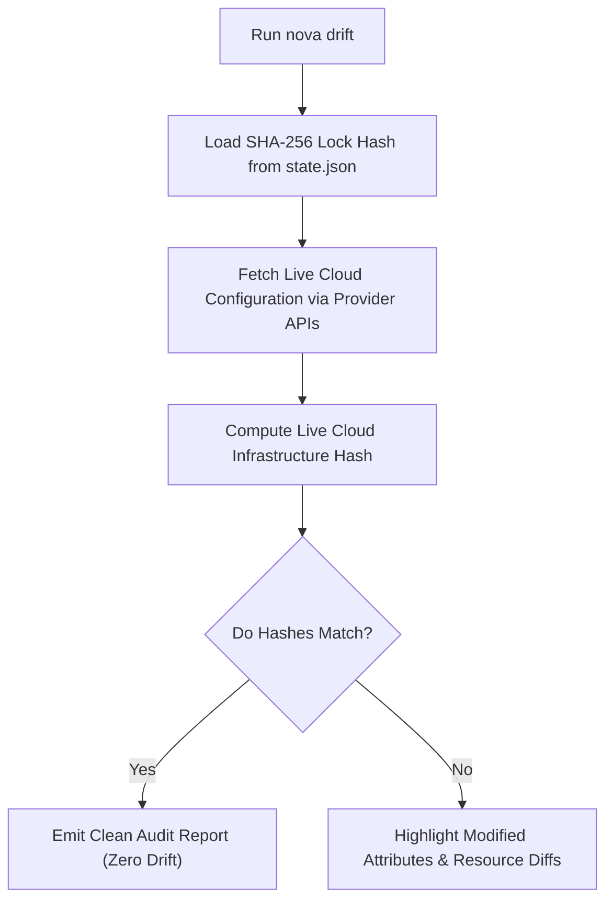

# Infrastructure Drift & Remediation

This document details how NovaServe detects out-of-band cloud modifications (drift) and remediates state mismatches.

---

## What is Infrastructure Drift?

**Infrastructure Drift** occurs when live cloud resources are modified directly via cloud vendor consoles, CLI tools, or external scripts outside of your Infrastructure as Code repository.

Examples of drift:
- An engineer manually alters an S3 bucket CORS policy in the AWS Console.
- A developer manually increases Lambda memory from 512MB to 2048MB.
- An automated script attaches an untracked IAM policy to a execution role.

Drift introduces security risks, breaks reproducible deployments, and causes unexpected failure modes.

---

## How `nova drift` Works

NovaServe provides a dedicated CLI auditing engine:

```bash
nova drift
```

### Audit Pass Algorithm



---

## Remediating Drift (`nova drift --fix`)

When drift is detected, run `nova drift --fix` to automatically restore live cloud infrastructure back to your code AST's exact target state:

```bash
nova drift --fix
```

**CLI Execution Output:**
```text
[NovaServe Drift Remediation] Auditing AWS us-east-1 resources...
  ⚠️ DRIFT DETECTED: S3 Bucket (user-uploads)
     - Attribute: PublicAccessBlock
     - Live Cloud Value: False (Unrestricted)
     - State Lock Value: True (Restricted)

  [Fixing] Restoring S3 PublicAccessBlock to True... Done (0.6s)

✓ All resources restored to state lock checksum. Drift remediated cleanly.
```
