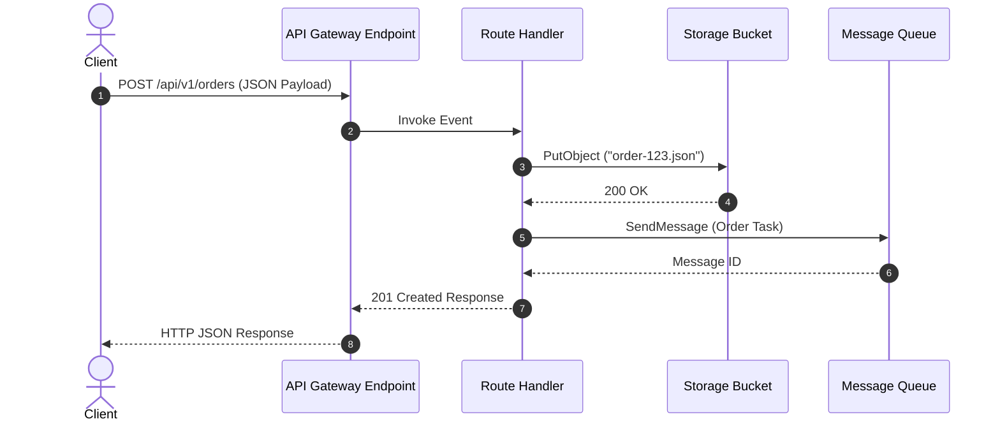

# Serverless API Development Guide

This guide walks through building a production-ready, type-safe serverless REST API connected to object storage and background message queues.

---

## Architecture Overview



---

## Complete `App.ts` Implementation

```typescript
import { defineApp, api, storage, queue } from "novaserve";

export const app = defineApp({
  name: "order-management-service",
  region: "us-east-1",
});

// 1. Storage bucket for raw order receipts
export const orderStorage = storage("order-receipts-bucket", {
  public: false,
});

// 2. Message queue for asynchronous order processing
export const orderQueue = queue("order-processing-queue");

// 3. Health check GET endpoint
export const healthApi = api.get("/health", async () => {
  return {
    status: "healthy",
    timestamp: new Date().toISOString(),
    version: "1.0.0",
  };
});

// 4. Create order POST endpoint
export const createOrderApi = api.post("/api/v1/orders", async (req) => {
  try {
    const body = await req.json();

    if (!body.customerEmail || !body.items || body.items.length === 0) {
      return {
        status: 400,
        body: { error: "Invalid order payload: missing customerEmail or items" },
      };
    }

    const orderId = `ord-${Date.now()}-${Math.random().toString(36).substring(2, 7)}`;
    const orderPayload = {
      orderId,
      customerEmail: body.customerEmail,
      items: body.items,
      totalAmount: body.totalAmount,
      createdAt: new Date().toISOString(),
    };

    // Store raw JSON in object storage
    await orderStorage.put(`receipts/${orderId}.json`, JSON.stringify(orderPayload));

    // Dispatch background processing task to queue
    await orderQueue.push({
      event: "ORDER_CREATED",
      orderId,
      customerEmail: body.customerEmail,
    });

    return {
      status: 201,
      body: {
        message: "Order placed successfully",
        orderId,
      },
    };
  } catch (err: any) {
    return {
      status: 500,
      body: { error: "Internal Server Error", details: err.message },
    };
  }
});
```

---

## Local Development & Testing

1. Start local emulator:
   ```bash
   nova dev
   ```

2. Test health check endpoint:
   ```bash
   curl http://localhost:3000/health
   ```

3. Submit a test order:
   ```bash
   curl -X POST http://localhost:3000/api/v1/orders \
     -H "Content-Type: application/json" \
     -d '{"customerEmail": "user@example.com", "items": [{"id": "item-1", "price": 49.99}], "totalAmount": 49.99}'
   ```

---

## Deployment to AWS

Deploy your application:

```bash
nova deploy --target aws
```

NovaServe automatically compiles your code AST, synthesizes IAM permissions for `s3:PutObject` and `sqs:SendMessage`, and provisions AWS API Gateway v2 + Lambda endpoints.
